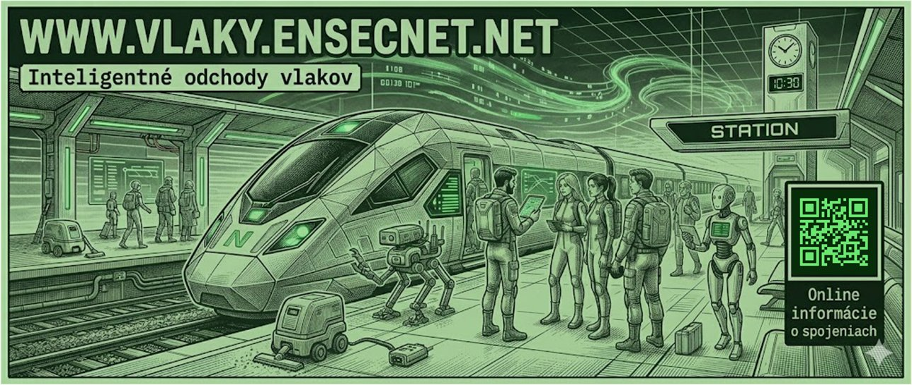
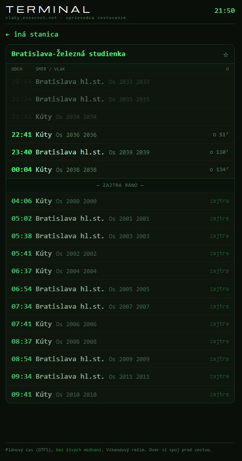
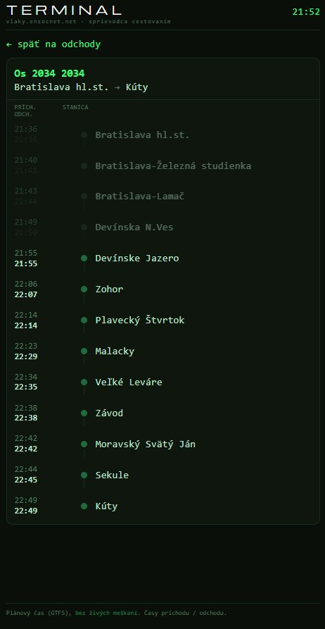
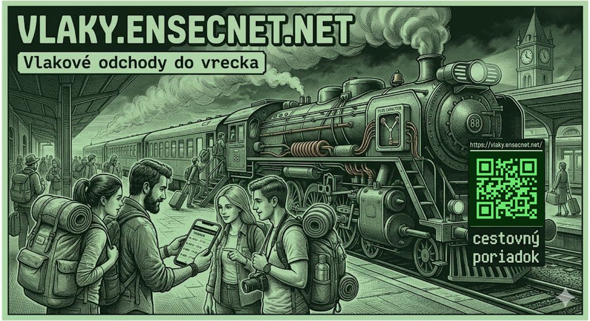
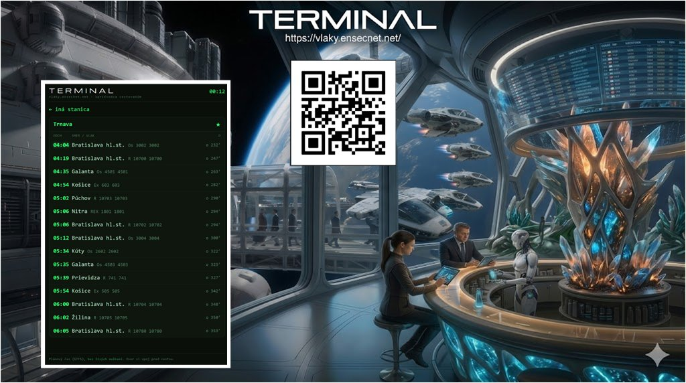

<div align="center">

<a href="https://vlaky.ensecnet.net"></a>

# 🚆 vlaky.ensecnet.net

**A universal Slovak train departure board**

Pick a station · live-counting departures · Cloudflare Worker + D1 · PWA

[](https://ensecnet.github.io/vlaky/index.html)
[](https://vlaky.ensecnet.net)
[](https://workers.cloudflare.com/)

</div>

---

> ### 📖 [**Read the full documentation →**](https://ensecnet.github.io/vlaky/index.html)
>
> Architecture, deployment, and GTFS data refresh — published as a documentation
> site with sidebar navigation (EN / SK). This README is the summary.

---

<div align="center">

### 🚆 Live: [**vlaky.ensecnet.net**](https://vlaky.ensecnet.net)



</div>

## Why this exists

This board is small **on purpose**. It's a working demonstration that a genuinely
useful public service can be built from **open data, a free cloud tier, and modern
AI-assisted development** — without a data centre, a budget, or a team.

- **Open state data, used properly.** The timetable comes from the official GTFS
  feed the state publishes on [data.slovensko.sk](https://data.slovensko.sk).
  Public data is there to be built on — this is what that looks like in practice:
  take the feed, transform it, give people something they can actually use.
- **Minimal infrastructure, near-zero cost.** One Cloudflare Worker, one D1
  database, a 45-second edge cache. No origin server, nothing running 24/7 to pay
  for — it serves hundreds to thousands of people a day inside the free tier. The
  whole architecture fits on a napkin.
- **Built fast with AI vibe coding.** From idea to a deployed PWA with search,
  GPS, trip routes, stats, and an ops dashboard — built quickly with AI-assisted
  development. The barrier between *"I have an idea"* and *"it's live on a domain"*
  has collapsed.

> **The point:** when the will is there, a path opens — even for things that look
> like they need a big system, a budget, and months of work. Open data + a free
> cloud edge + AI as a force multiplier turns a weekend into a real, public,
> installable app. That's the demonstration.

## What it is

A departure board for Slovak train stations: choose a station and see three
just-left departures (dimmed) plus the next fifteen — each with destination,
train number, and a live countdown. Plan times come from GTFS (ZSSK / ŽSR);
no live delays.

Built as a single **Cloudflare Worker** with a **D1 (SQLite)** database and a
45-second edge cache — no origin server, runs inside the free tier.

## Features

- **Station search** with an accent-normalising autocomplete
- **Favourites** kept in `localStorage` on the device
- **Per-station URL** (`/{station}`) — bookmark or pin to the home screen
- **📍 GPS nearest station** — coordinates are used and discarded, never stored
- **PWA** — installable, app-like
- **Live countdown** — "in X′ / now"
- **45-second edge cache** — absorbs traffic spikes, keeps D1 idle
- **Anonymous aggregate stats** — day · station · hour · region; no IPs, no individuals
- **`/ops` dashboard** — operational view behind login

## Privacy by design

GPS coordinates for the nearest-station lookup are used in the request and thrown
away — never stored. Statistics are aggregate only (day, station, hour, region
from the Cloudflare edge); no IP addresses, no individual tracking.

## Tap a train → its route

Tap any departure and the board opens that train's full route — every station it
calls at (`/vlak/{number}`), with arrival and departure times. Stations already
passed are dimmed; stations still ahead are bright, so the current position reads
at a glance.

<div align="center">



</div>

## Direct station link + home-screen shortcut

Every station has its own URL — append the station to the address and the board
opens straight on it:

```
https://vlaky.ensecnet.net/bratislava-zelezna-studienka
```

Bookmark it, or use the browser's **"Add to Home Screen"** to drop an icon that
opens your station in one tap — effectively a per-station app shortcut.

## Installable app — no store needed

The whole thing is built as a **PWA (Progressive Web App)**, so it installs
straight onto your phone from the browser — no App Store, no Google Play. Open
the site, choose **"Add to Home Screen" / "Install"**, and it lands as an icon
and runs full-screen like a native app. Favourites and your pinned station travel
with it.

## Quick start

```bash
cd ~/vlaky && npm install
npx wrangler d1 create vlaky          # paste database_id into wrangler.toml
npx wrangler d1 execute vlaky --remote --file=./migrations/0001_init.sql
node build-d1.js gtfs.zip             # build timetable from GTFS
npx wrangler d1 execute vlaky --remote --file=./data/seed.sql
npx wrangler deploy                   # binds vlaky.ensecnet.net (custom_domain)
```

Full walk-through — schema, seeding, `/ops` login, custom domain — is in the
**[documentation](https://ensecnet.github.io/vlaky/pages/deploy.html)**.

## Repository layout

```
vlaky/
├─ src/index.js              # Worker: board, search, geo, stats, /ops, PWA
├─ migrations/0001_init.sql  # D1 schema
├─ build-d1.js               # GTFS zip → data/seed.sql + data/stations.json
├─ data/seed_sample.sql      # small sample for a pre-GTFS test
├─ update.ps1                # one-shot GTFS refresh (Windows)
├─ wrangler.toml
└─ package.json
```

## Documentation

Served from the `docs/` folder via GitHub Pages (EN primary, SK switch):

| Page | What's in it |
|------|--------------|
| [Overview](https://ensecnet.github.io/vlaky/index.html) | Features, privacy model |
| [Architecture](https://ensecnet.github.io/vlaky/pages/architecture.html) | Worker + D1, edge cache, endpoints |
| [Deployment](https://ensecnet.github.io/vlaky/pages/deploy.html) | From npm install to bound domain |
| [GTFS data refresh](https://ensecnet.github.io/vlaky/pages/data.html) | Rebuilding the timetable |

## Limits / cost

Free tier: Worker 100k req/day, D1 5 GB + 5M reads/day. With the 45-second edge
cache that holds hundreds to thousands of daily users for free. Times are GTFS
**plan**, not realtime — a realtime board would need a GTFS-RT feed, which
Slovakia doesn't publish openly yet (there's a hook for it in the Worker).

## Promo banners

<div align="center">

 

</div>

> Set the hero banner as the repository **Social preview** in *Settings → General →
> Social preview* so it shows when the link is shared (LinkedIn, Slack, Discord).

## License

GTFS data © ZSSK / ŽSR, from [data.slovensko.sk](https://data.slovensko.sk).
Code under this repository's license.
